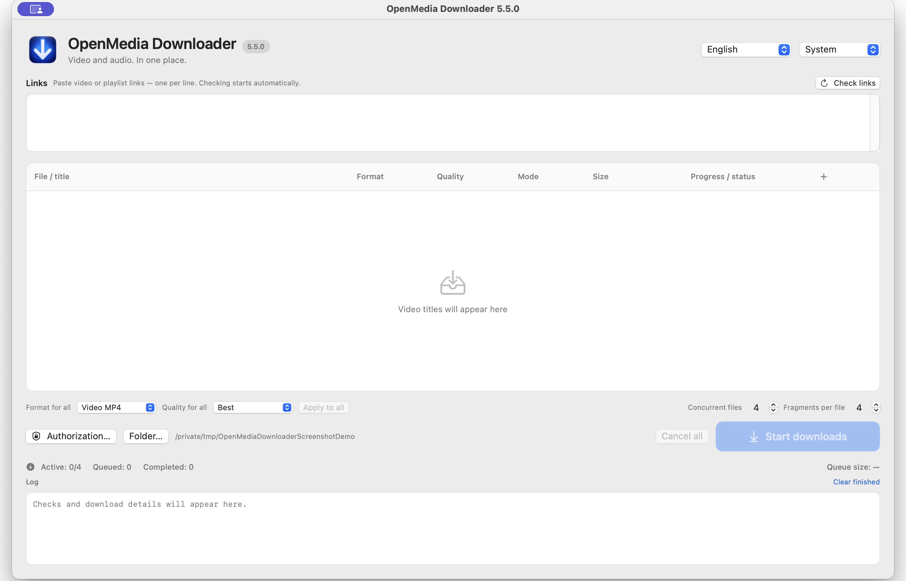

# Formats, transfer modes, and streams

## File downloads

| Choice | Result | Notes |
| --- | --- | --- |
| Video | MP4 | Video and audio may be separate and are combined when needed. The source must offer compatible formats. |
| AAC | M4A | An existing AAC stream is copied without re-encoding. If no suitable AAC source exists, the app does not pretend one does. |
| MP3 | MP3 | Audio is converted with FFmpeg. The selected MP3 bitrate is an encoding setting, not a promise about source quality. |

Available quality depends on the video. AAC has no video resolution setting. **Auto**, **Direct**, and **Fragments** use different available source paths. Direct transfer can fail when the source has no suitable continuous stream. Fragment transfer depends on the source's HTTP, HLS, or DASH formats. Not every video offers every option.

A displayed file size may be an estimate (`≈`). When the size is unknown, the app does not invent a zero value. Video and audio may have separate size estimates.

## Recording ongoing streams

The app can identify supported scheduled, ongoing, or completed broadcasts. A scheduled stream does not occupy a download slot. For an ongoing stream, choose **Record from now**. **From the beginning** is offered only when the source explicitly reports support; the feature is experimental and can still fail at the source.

During a live recording, the app shows elapsed time, transferred data, and rate. A percentage or final file size is not known while the broadcast is ongoing. Use **Stop and save** to finish writing cleanly. The app reports success only after the process, output, and media validation complete. If finalization fails, it may show a temporary recovery location; read the error before deleting anything.

AAC/M4A is copied only when the stream contains AAC. MP3 conversion runs after stopping. The app does not force extraction of unrecognized or protected streams.
