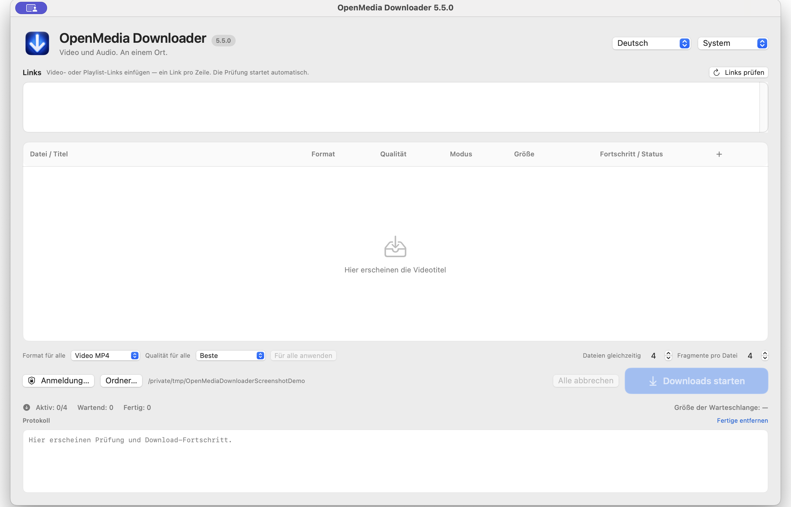

# Fehlerbehebung

## Link bleibt bei Prüfung oder zeigt keinen Titel

Prüfen Sie, ob es ein unterstützter Video-, Playlist- oder normaler Einbettungs-Link ist und ob der Mac die Quelle erreichen kann. Klicken Sie auf **Links prüfen**. Eine fehlgeschlagene Untersuchung startet keinen Download. Bei einer Playlist können einzelne Einträge nicht verfügbar sein; andere Ergebnisse bleiben auswählbar.

## Gewünschtes Format oder Qualität fehlt

Die App kann nur Formate anzeigen, die die Quelle anbietet. AAC/M4A erscheint nur bei passender AAC-Tonspur. MP3 benötigt eine Umwandlung. Eine Direktübertragung kann fehlen, wenn kein geeigneter vollständiger Stream vorhanden ist. Probieren Sie Auto oder Fragmente, falls verfügbar.

## Anmeldung, Cookies oder Safari schlägt fehl

Cookies sind optional. Probieren Sie bei öffentlichem Material **Ohne Cookies fortfahren**. Für Safari benötigt OpenMedia Downloader 5.5 selbst den Festplattenvollzugriff, danach ist ein Neustart der App nötig. Siehe [Cookie-Anleitung](COOKIES.md). Chrome oder andere Browser können einen Schlüsselbunddialog auslösen. Eine positive Cookie-Prüfung beweist nicht, dass das Konto Zugriff auf das Video hat.

## Stream kann nicht starten oder nicht gespeichert werden

Eine geplante Sendung hat noch nicht begonnen. Eine beendete Sendung kann erneut geprüft werden; eventuell stellt die Quelle keine abspielbare Datei bereit. **Von Anfang an** ist experimentell und nur verfügbar, wenn die Quelle es meldet. Bei Finalisierungsfehlern wird kein erfolgreicher Abschluss behauptet. Folgen Sie dem angezeigten Wiederherstellungshinweis, falls vorhanden.

## Download schlägt fehl oder wird abgebrochen

Prüfen Sie Netzwerk und freien Speicherplatz. Ein Anbieter kann eine URL, ein Format oder Anmeldeanforderungen geändert haben. Wiederholen Sie die Prüfung und versuchen Sie bei öffentlichen Links den anonymen Weg. Das Abbrechen eines Auftrags beendet nur diesen Prozess; **Alle abbrechen** stoppt die Warteschlange.

## Problem melden

Nutzen Sie eine [Issue-Vorlage](../.github/ISSUE_TEMPLATE/). Beschreiben Sie Schritte und erwartetes Verhalten. Entfernen Sie aus jedem Text, Screenshot oder Anhang Kontonamen, persönliche Pfade, Cookies, Tokens, signierte URLs und private Mediennamen. Hängen Sie keine Browserdatenbank oder vollständige private Logs an.
