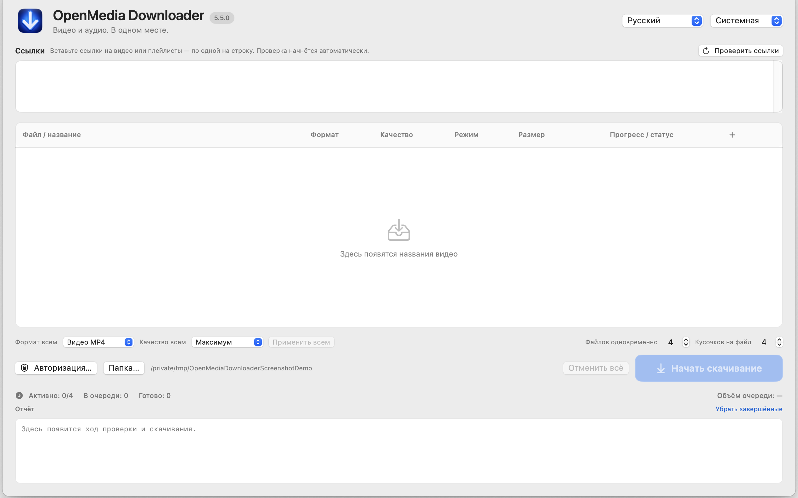

# Устранение неполадок

## Ссылка долго «проверяется» или название не появилось

Проверьте, что это поддерживаемая ссылка на видео, плейлист или стандартный встроенный плеер и что Mac может открыть источник. Запустите **Проверить ссылки** ещё раз. Неудачная проверка не начинает скачивание. В плейлисте могут быть недоступные ролики — остальные результаты всё ещё можно выбрать.

## Нет нужного формата или качества

Программа показывает только форматы, которые предлагает источник. AAC/M4A доступно только при наличии подходящей аудиодорожки AAC. Для MP3 требуется преобразование. Прямая передача может быть недоступна, если нет подходящего цельного потока. Если варианты есть, попробуйте режим «Авто» или «Фрагментами».

## Не работает вход, cookies или Safari

Cookies необязательны. Для публичного видео попробуйте **Продолжить без cookies**. Safari требует предоставить полный доступ к диску самому приложению OpenMedia Downloader 5.5, а затем перезапустить приложение. Подробности — в [инструкции по cookies](COOKIES_RU.md). Chrome и другие браузеры могут показать запрос Связки ключей. Успешное чтение cookies не доказывает, что у аккаунта есть доступ к видео.

## Трансляция не начинается или не сохраняется

Запланированная трансляция ещё не началась. Завершённую трансляцию можно проверить ещё раз, но источник может пока не предоставить готовую запись. Режим **С начала** экспериментальный и отображается только при подтверждении поддержки источником. При ошибке финализации программа не пишет, что всё завершено успешно. Если приложение указало путь восстановления, следуйте этой подсказке.

## Загрузка завершилась ошибкой или была отменена

Проверьте сеть и свободное место на диске. Сервис мог изменить ссылку, формат или требования ко входу. Повторите проверку; для публичной ссылки попробуйте вариант без cookies. Отмена одного задания останавливает только его; **Отменить всё** останавливает очередь.

## Сообщить об ошибке

Используйте [форма сообщения об ошибке](https://github.com/popovantondev/openmedia-downloader/issues/new/choose). Опишите шаги и ожидаемый результат. Удалите из текста, снимков экрана и вложений имена аккаунтов, личные пути, cookies, токены, подписанные ссылки и названия личных видео. Не прикладывайте базу браузера или полный личный журнал.
